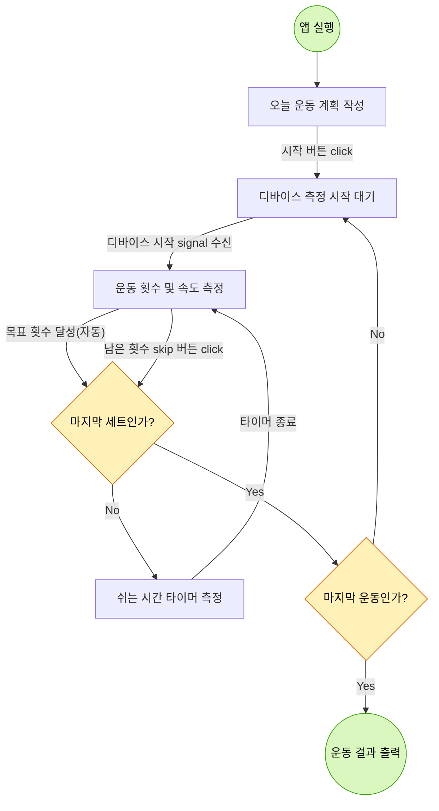

# 기능 요구사항

**1. Daily 운동 계획 작성**

- 사용자는 오늘 할 운동명, 횟수, 세트, 1회 왕복시간, 세트별 쉬는시간을 작성합니다
- 애플리케이션은 사용자가 작성한 내용을 바탕으로 오늘 운동 내용을 관리합니다

**2. 디바이스 측정 내용 기록**

- 디바이스의 운동 시작 신호를 수신합니다.
- 디바이스에서 측정한 운동 횟수를 기록합니다
- 디바이스에서 측정한 운동 속도를 기록합니다
- 현재 운동 횟수와 달성 세트를 보여줍니다.

**3. 운동 세트별 쉬는시간 관리**

- 한 세트가 끝나면 사용자가 작성한 쉬는시간을 기반으로 타이머를 보여줍니다
- 쉬는시간이 종료되면 달성세트를 업데이트하고 디바이스의 운동 시작 신호를 대기합니다

**4. 운동 결과 분석**

- 사용자가 작성한 운동이 모두 끝나면 운동별 달성 기록들을 보여줍니다

## 요구사항 분석

### User Flow Chart

