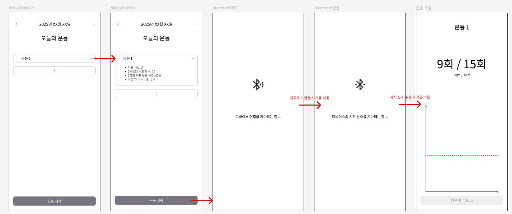

# 디바이스 통신 설계

## 요구사항

디바이스와의 통신은 블루투스를 기본으로 한다.

1. 디바이스의 시작 signal을 수신한다

   - 전제조건: 사용자가 앱의 시작버튼을 누른 후에만 수신할 수 있다.

   - System flow chart

     ```mermaid
     graph LR
         Start --> WaitingConnection
         WaitingConnection --> |디바이스 연결|WaitingSignal
         WaitingSignal--> |시작 signal 수신|StartWorkOut

         Start[App 시작 버튼 클릭]
         WaitingConnection[블루투스 연결 대기]
         WaitingSignal[시작 signal 대기]
         StartWorkOut[운동 측정 시작]
     ```

   - UI 예시

     

## 설계

### 블루투스 연결

- 블루투스 라이브러리: `react-native-ble-manager`

  - `react-native-ble-plx`와 비교하였을 때 본딩 기능을 지원하여 선택

- **연결 방법**: 디바이스 스캔 ➡️ 디바이스 연결 ➡️ 통신

  1. 라이브러리 시작: `start`
  1. 사용자의 블루투스 활성화 확인 필요: `enableBluetooth()`
  1. 주변 디바이스 스캔을 위한 위치 권한 부여 필요
  1. 근처 기기 스캔: `scan`

     - 본딩된 기기 가져오기: `getBondedPeripherals()`
     - 최초 연결 시, 본딩 생성 필요

  1. 장치 연결
  1. 연결해제

- 핵심 모듈 설계
  1. UI
     - `BluetoothPage.tsx`
       - 블루투스 연결 화면
       - 사용자 입출력 역할
       - 서비스 로직 포함 X
  1. 서비스
     - `BluetoothService.ts`
       - 블루투스 통신 담당
     - `PermissionService.ts`
       - 권한 관리 및 제어
  1. 훅
     - `userBluetooth.ts`
       - 블루투스 상태 관리
       - UI와 서비스 사이에서 동작. 서비스와 UI를 연결

참고

[1] https://blog.logrocket.com/using-react-native-ble-manager-mobile-app/

[2] https://medium.com/@varunkukade999/part-1-bluetooth-low-energy-ble-in-react-native-694758908dc2
