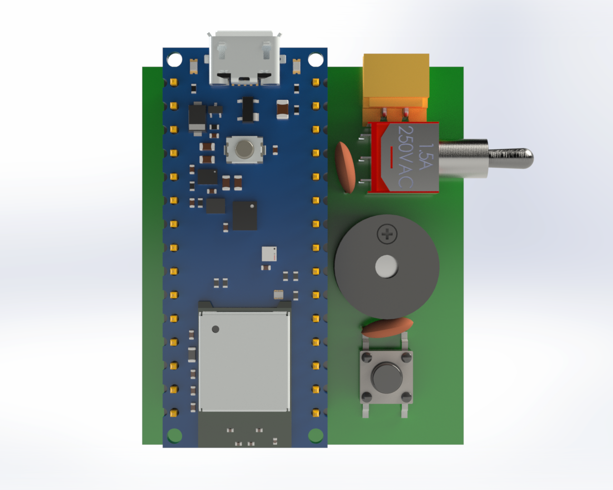
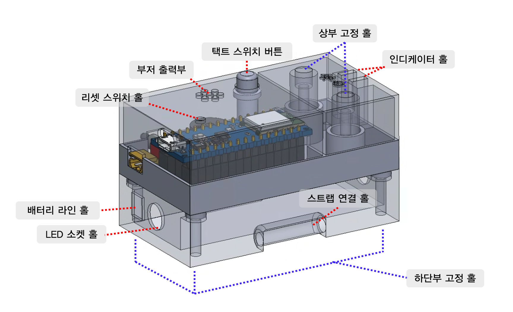
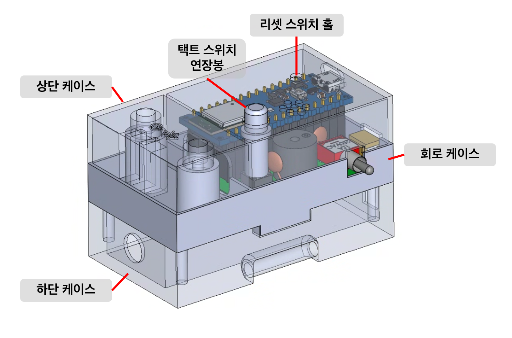
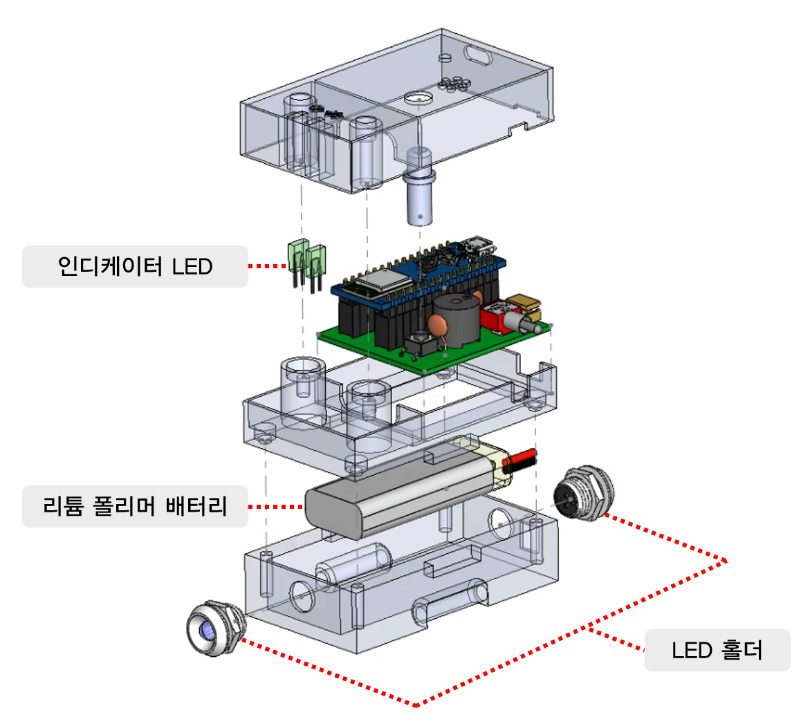
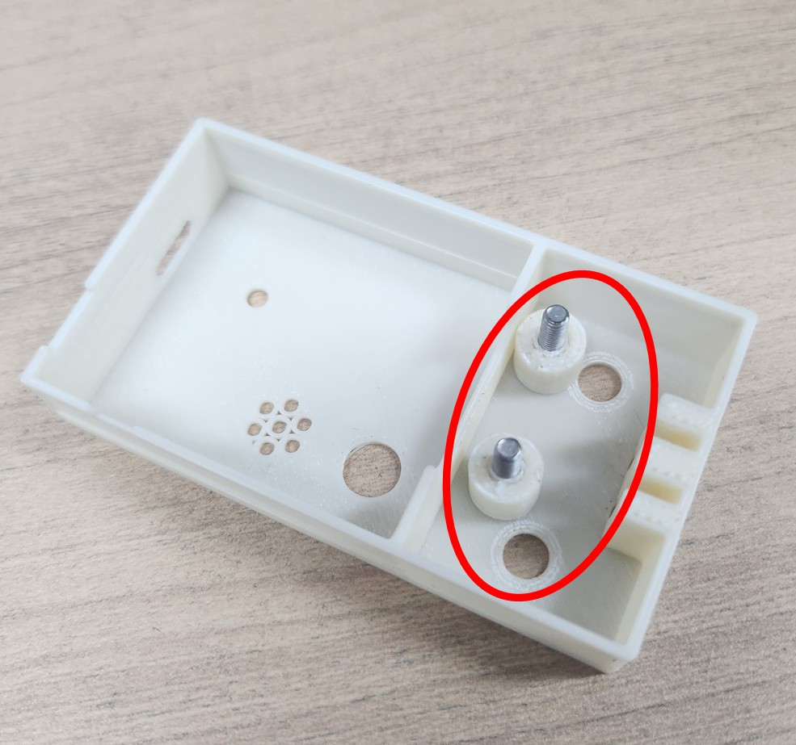
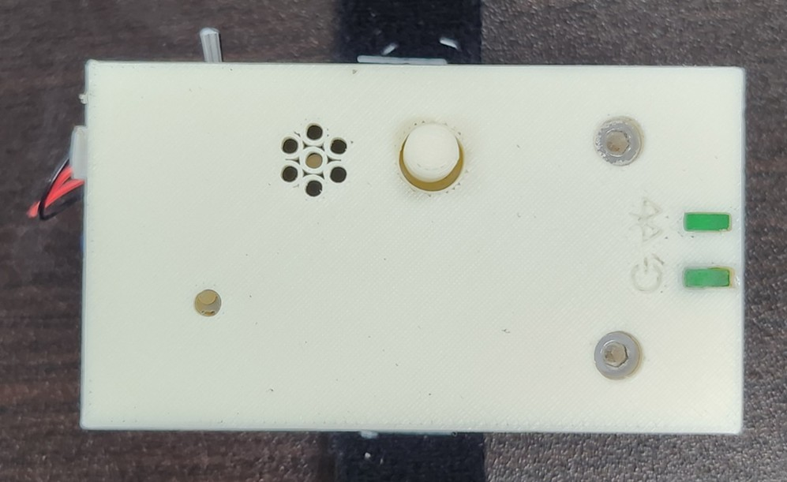
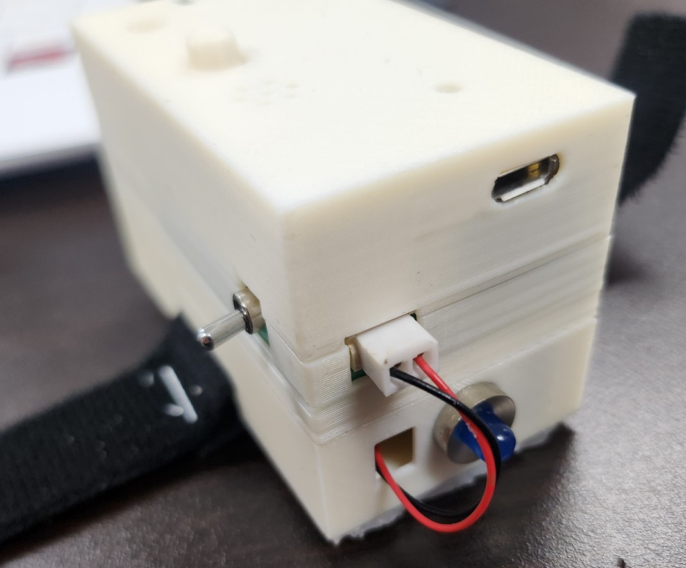
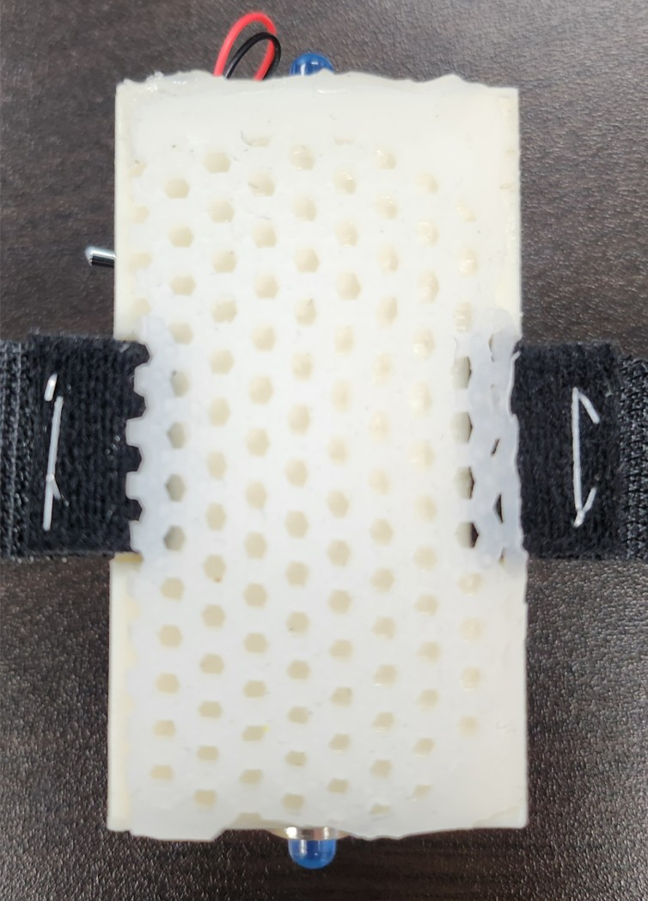

## 아두이노 핀 구성

|기능|핀 번호|
|:---:|:---:|
|부저|`D6`|
|스위치|`D3`|
|파워 인디케이터|`D7`|
|BLE 인디케이터|`D4`|
|좌측 LED|`D5`|
|우측 LED|`D8`|
|배터리 량|`A0`|
 

## 회로도

 

## 기판 형상

* 8/16 실제 구성한 회로를 치수를 맞춰 3D 모델 생성하였습니다.

 

## 기기 모델링

* 8/20 운동시에 사용할 기기를 3D로 모델링하였습니다.

 

* 8/22 3D 프린터로 기기 출력 후 공차에 맞춰서 재수정.
- `tact switch` 연장 봉 길이 축소
- `상단 케이스`의 볼트 체결부 길이가 길어 하단까지 나사선 부분의 길이가 부족 -> `회로 케이스`의 체결부 높이를 높이고 `상단 케이스`의 체결부 길이를 줄임
- `Arduino NANO`의 `리셋 스위치`의 위치와 `상부 케이스`의 구멍이 맞지 않아 위치 수정
-  `회로 케이스`와 `하단 케이스` 사이의 볼트 체결부가 `회로 케이스`에서 하단으로 돌출되어 있는 구조였으나 3D 프린팅 과정에서 내구성 문제로 부서지는 문제 발생 -> `회로 케이스`의 바닥에 구멍을 뚫는 방식으로 돌출되지 않도록 변경 

 

* 모든 부품을 포함한 3D 모델 분해도

## 기기 형상

### 8/26

* `상단 케이스`의 볼트 체결부가 부러지는 문제 발생
* 부저의 소리가 작아서 운동 왕복시 소리가 잘 들리지 않음

부저 교체 및 상판 두께를 2mm 증가
 

### 조립 완성품
 
기기 상단
- `리셋 스위치` 구멍, 기기 전원과 BLE 연결 확인용 인디케이터, 시작 스위치
 
기기 정면
- `Arduino NANO`의 포트 구멍, 배터리 연결부, 기기 전원 `토글 스위치`, 기울임 감지 LED

 
기기 하단
- 운동기기에서 미끄러지지 않도록 육각형 패턴의 미끄럼 방지 패드 부착